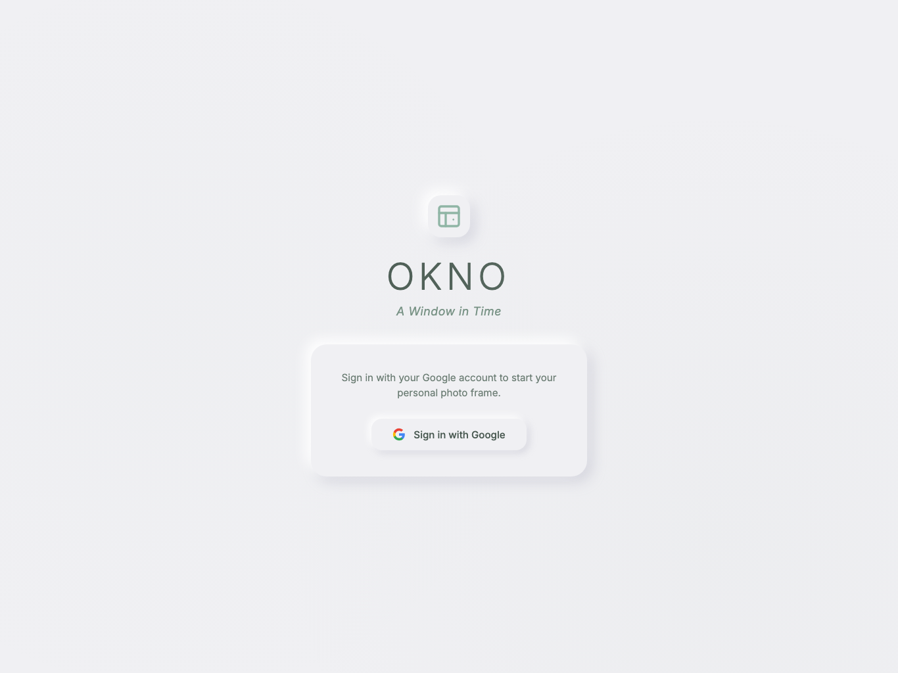
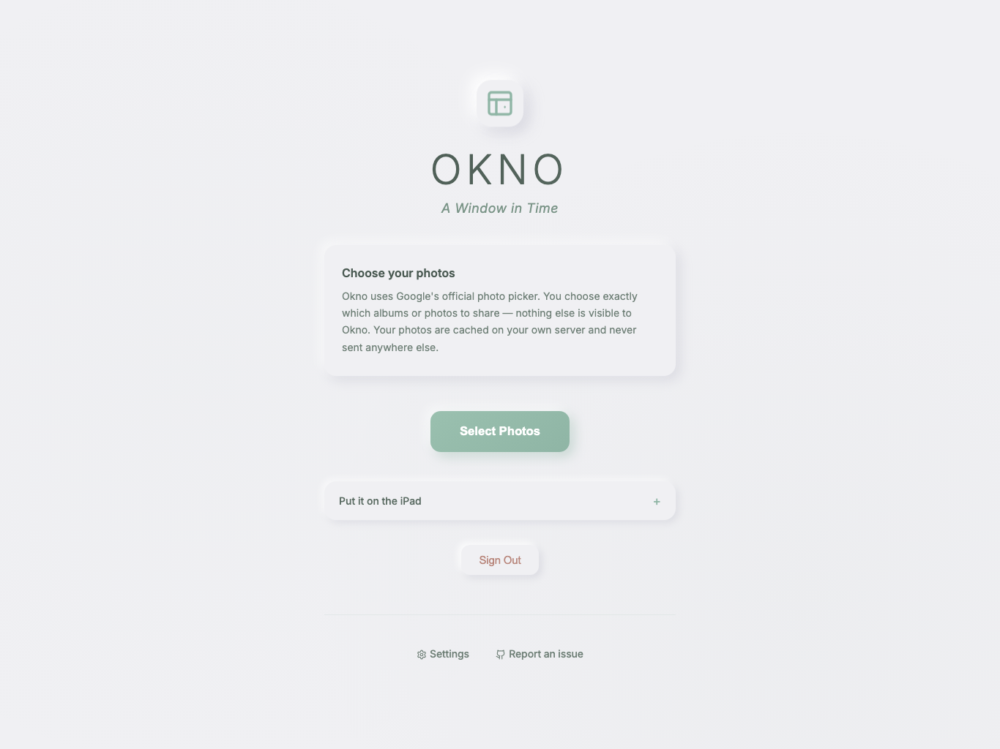
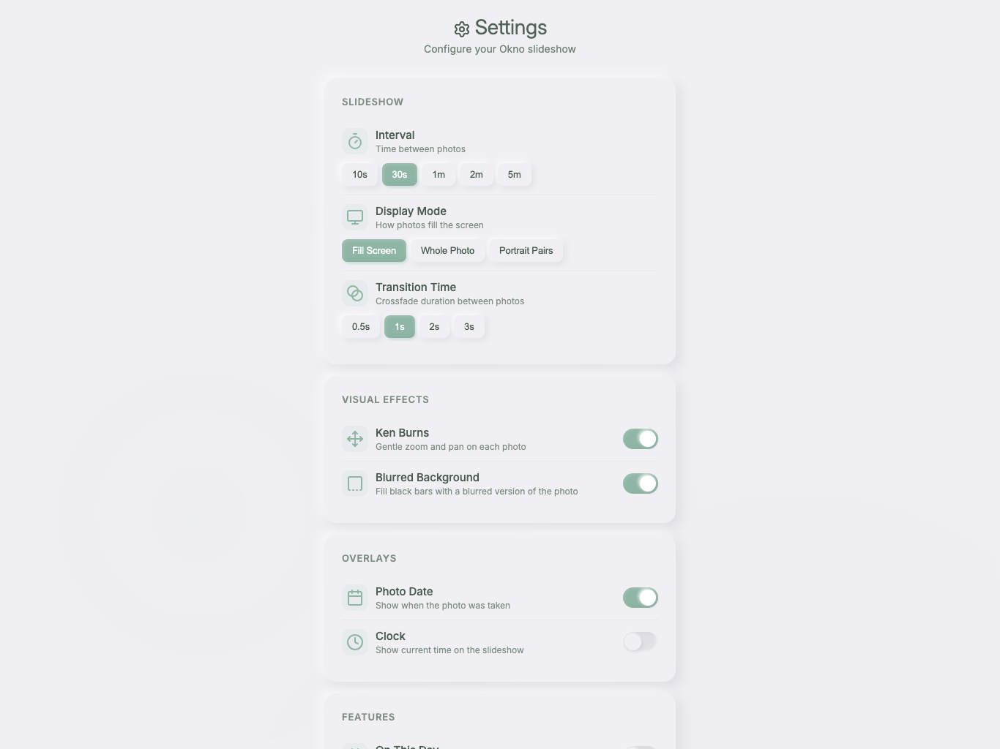

# Okno

**Turn an old iPad into a window full of your adventures.**

"Okno" is the Polish word for window.

---

## The story

My partner's old iPad had been gathering dust in our small apartment for a couple of years. We had years of adventures sitting in Google Photos — hikes, dinners, weekends away — locked in a phone and never looked at.

Commercial digital frames wanted monthly subscriptions and their own cloud. I didn't want our photos going through anyone else's server. So I built Okno: a small self-hosted web app that turns any old tablet into a living photo frame, powered entirely by your own Google Photos library and your own server.

It's free, it's self-hosted, and your photos never touch a third-party server. The Google Photos Picker API means you choose exactly which photos Okno can see — it never gets access to your whole library.

---

## What it does

- Picks photos via the official Google Photos Picker — you select exactly what it can see, nothing more
- Slideshow with smooth crossfade transitions and Ken Burns pan/zoom
- Three display modes: Fill Screen, Whole Photo, and Portrait Pairs (two portrait photos side-by-side)
- On This Day mode surfaces photos from the same date in past years
- Warm neumorphic UI that looks right at home on an iPad
- Multiple Google accounts, fully isolated — each person has their own photos, settings, and tokens
- Runs as a PWA: add to the iPad home screen, it behaves like a native app
- Demo mode so you can try it before connecting your photos

---

## Screenshots

| The frame | Sign in |
|---|---|
|  |  |

| Choose your photos | Settings |
|---|---|
|  |  |

---

## Quickstart (Docker)

This is the recommended path. You need Docker and Docker Compose installed.

```bash
git clone https://github.com/samshennan/okno.git
cd okno
cp .env.example .env
```

Edit `.env` with your Google Cloud credentials (see [docs/GOOGLE-OAUTH-SETUP.md](docs/GOOGLE-OAUTH-SETUP.md) for the one-time setup).

```bash
docker compose up -d
```

Okno is now running on port 3100. Put it behind nginx with SSL — see [docs/DEPLOYMENT.md](docs/DEPLOYMENT.md).

---

## Manual install (Node 18+)

```bash
git clone https://github.com/samshennan/okno.git
cd okno
npm ci
cp .env.example .env
# fill in .env
node server.js
```

For production: use PM2 (`ecosystem.config.js` is included) and nginx. Full instructions in [docs/DEPLOYMENT.md](docs/DEPLOYMENT.md).

---

## Put it on the iPad

1. Open your Okno URL in Safari on the iPad
2. Tap the Share button, then "Add to Home Screen"
3. Launch Okno from the home screen icon
4. Sign in with Google, tap "Select Photos", choose your collection
5. Tap "Start Slideshow"

Optional: enable Guided Access (Settings > Accessibility > Guided Access) to lock the iPad to Okno and prevent accidental taps waking other apps.

The screen stays awake automatically during the slideshow — no need to change Auto-Lock settings.

---

## Settings

| Setting | What it does |
|---------|-------------|
| Display mode | Fill Screen (crop to fill), Whole Photo (letterbox), Portrait Pairs (two portraits side-by-side) |
| Interval | How long each photo shows: 10s, 30s, 1m, 2m, 5m |
| Ken Burns | Slow pan and zoom on each photo |
| Blurred background | Fills letterbox bars with a blurred version of the photo |
| Show photo date | Overlays the photo's date in the corner |
| Show clock | Displays the current time |
| On This Day | Prefers photos taken on today's date in previous years |
| Transition time | Crossfade duration |

---

## Privacy

- Photos are proxied through your own server — Google's `baseUrl` tokens require an `Authorization` header that browsers can't send directly from an `` tag. Your server adds that header. No third party ever sees your photos.
- The Google Photos Picker scope (`photospicker.mediaitems.readonly`) gives Okno access only to the photos you explicitly select. It cannot browse your full library.
- OAuth tokens are stored in your own SQLite database (`data/okno.db`).
- If you want to restrict which Google accounts can sign in, set `ALLOWED_EMAILS` in your `.env` (comma-separated). Leave it unset to allow any Google account.

---

## Reporting issues

[github.com/samshennan/okno/issues](https://github.com/samshennan/okno/issues)

---

## Licence

MIT — see [LICENSE](LICENSE).

Built with [Claude Code](https://claude.ai/claude-code).
